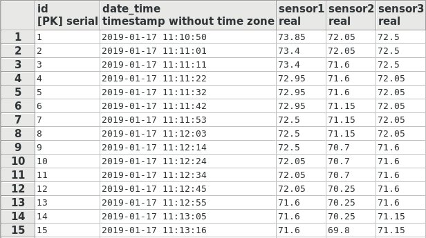
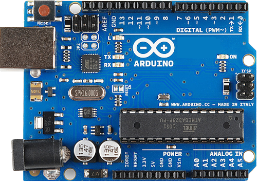
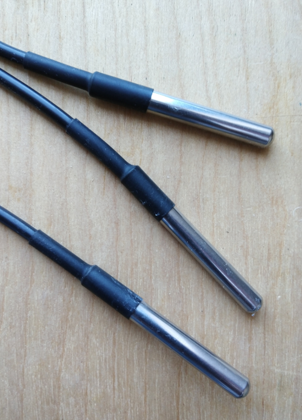
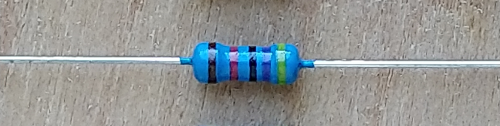
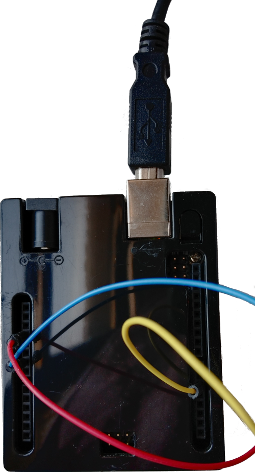

# Save Arduino sensor data to a Postgresql database using Python.

# Created with Python3, Postgresql, Psycopg2, Pyserial, and Arduino.







# Requirements:

```
Software:

- Python 3
- Postgresql
- Pyserial
- Psycopg2
- Python-dotenv
- Wire.h
- OneWire.h
- DallasTemperature.h

Hardware

- 1 Arduino board
- 3 DS19B20 onewire waterproof sensors
- 1 4.7k pull-up resistor

```

# Create a .env file:
```
$ vim .env
```

Add database url to .env file.

```
DATABASE_URI='postgres://<username>:<password>@<server_ip>:<port>/<database>'
```

# Run:

```
$ pipenv --python 3.7 shell

$ pipenv install 

```

```
$ python3 sensor_data.py

```

# License:

This project is licensed under the GPL-3.0 License.
